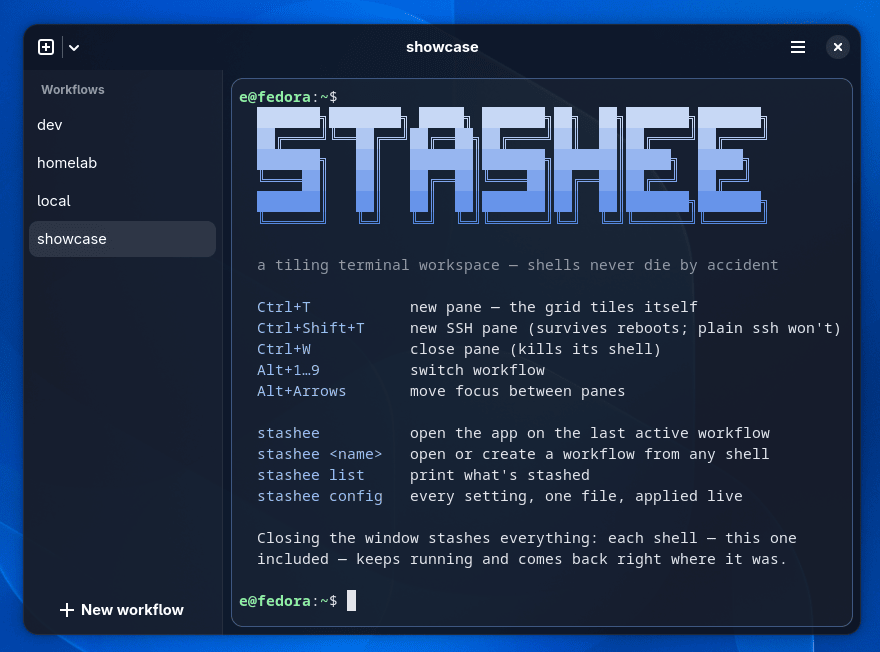
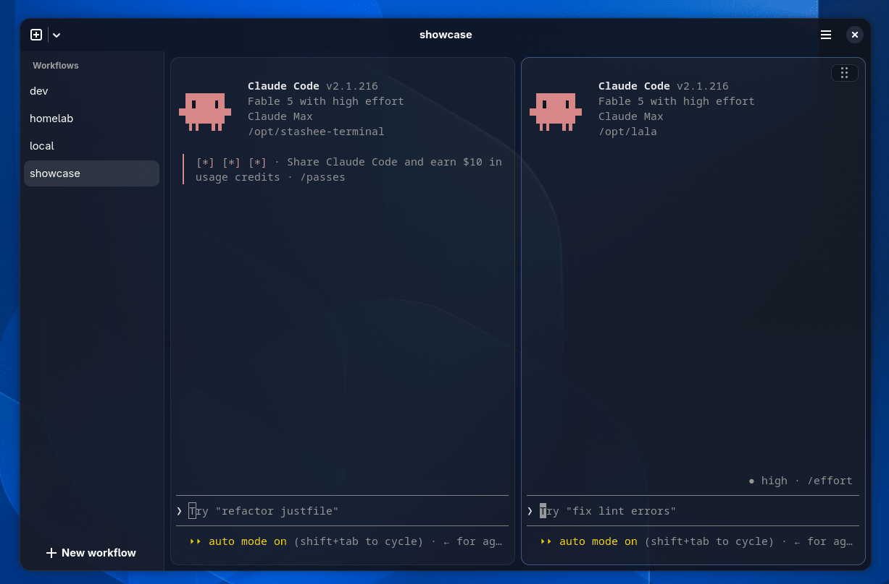
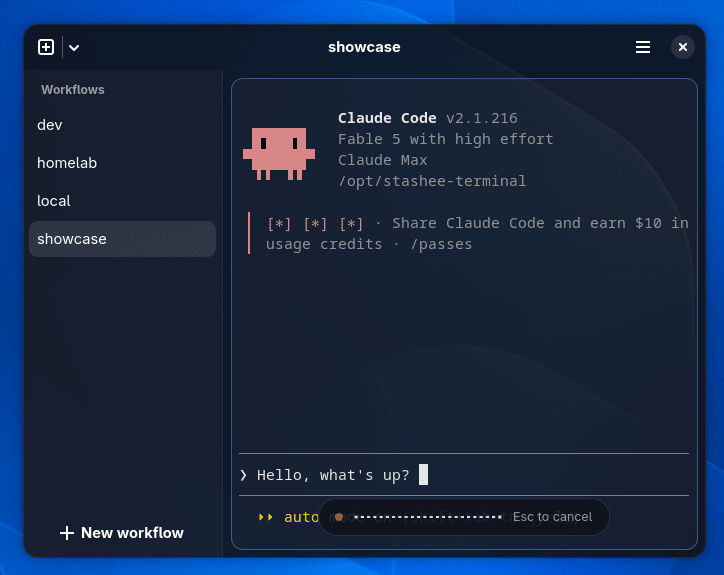

<div align="center">

# stashee

**A tiling terminal workspace for Linux.**

[](https://github.com/eeegoloauq/stashee-terminal/releases/latest)
[](https://copr.fedorainfracloud.org/coprs/eeegoloauq/stashee/package/stashee/)
[](https://aur.archlinux.org/packages/stashee)

Terminals are grouped into named **workflows** and tile automatically.
Every pane runs inside a tmux session, so closing the app **stashes** a
workflow instead of killing it. Reopen, and every shell is back exactly
where it was.



</div>

## Why

- Sessions live in tmux, not in the app. Quitting, crashing, or
  updating loses nothing; the window is only a client.
- No layout management. New panes tile automatically: up to three
  columns, then rows, always evenly split.
- SSH panes are stashed too. A pane on a remote host survives reboots
  and dropped connections, and remote copy lands in the local
  clipboard.
- Files go the other way too: drop a file or paste a screenshot into
  an SSH pane — it is scp'd up and the remote path is typed at the
  prompt.
- Native. Rust, GTK4, libadwaita, and VTE (the terminal engine behind
  GNOME Terminal and Ptyxis). No Electron, no webviews, no daemons.

<p align="center">
  
  <br>
  <sub>A coding agent per project in one stashed workflow. Closing the window kills neither.</sub>
</p>

## Usage

| | |
|---|---|
| `stashee work` | open the "work" workflow from any shell |
| `Ctrl+T` | new pane |
| `Ctrl+Shift+T` | new SSH pane |
| `Alt+1…9` | switch workflow |
| `Ctrl+W` | close pane (the only way a pane dies on purpose) |
| `Ctrl+Shift+V` | paste; a clipboard image becomes a file path, uploaded first on SSH panes |
| `stashee config` | open the config file; changes apply live ([all options](docs/config.toml.example)) |

There is no settings GUI, no plugin system, no theme gallery. The scope
is deliberately small.

## Voice input (experimental)

Local dictation, off by default: set `[voice] enabled = true` in the
config, press `Ctrl+Shift+Space`, speak, press it again. The
transcript is typed into the focused pane, never auto-sent.
Recognition runs on the CPU (NVIDIA's Parakeet model, 25 languages);
the model is a one-time ~670 MB download behind an explicit consent
dialog. Nothing leaves the machine.

<p align="center">
  
</p>

## Install

Fedora, via [COPR](https://copr.fedorainfracloud.org/coprs/eeegoloauq/stashee/):

```sh
sudo dnf copr enable eeegoloauq/stashee
sudo dnf install stashee
```

Arch, via the [AUR](https://aur.archlinux.org/packages/stashee):

```sh
yay -S stashee   # or: paru -S stashee
```

Each release on the
[releases page](https://github.com/eeegoloauq/stashee-terminal/releases)
also ships an `.rpm` for Fedora and a `.pkg.tar.zst` for Arch:

```sh
# Fedora
sudo dnf install ./stashee-*.rpm

# Arch
sudo pacman -U ./stashee-*.pkg.tar.zst
```

tmux is required; install it with your package manager if it is not
already present.

## Build

```sh
# Fedora
sudo dnf install gcc rust cargo gtk4-devel libadwaita-devel vte291-gtk4-devel
git clone https://github.com/eeegoloauq/stashee-terminal && cd stashee-terminal
just install        # release build → ~/.local/bin/stashee (+ st symlink)
```

At runtime Fedora Workstation needs nothing extra: GTK4, libadwaita,
and VTE ship with it.

## Contributing

Issues and PRs are welcome — see [CONTRIBUTING.md](CONTRIBUTING.md) for the build deps and
guidelines. `just check` runs the full gate (fmt, clippy, tests) that CI expects. The scope is
deliberately small, so for anything bigger than a fix, open an issue first so we can talk it
over before you spend time on it.

## License

[MIT](LICENSE).
