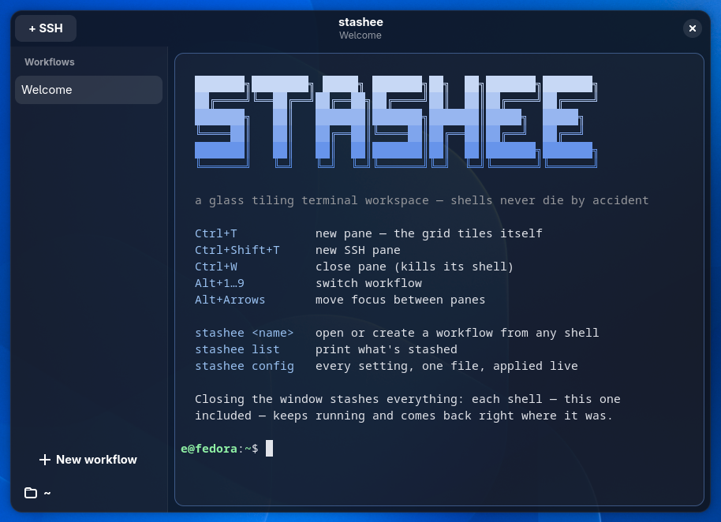

<div align="center">

# stashee

A glass-styled tiling terminal workspace for Linux.



</div>

Terminals are grouped into named **workflows** and tile automatically.
Every pane runs inside a tmux session, so closing the app **stashes** a
workflow instead of killing it. Reopen, and every shell is back exactly
where it was.

<div align="center">

</div>

## Why

- Sessions live in tmux, not in the app. Quitting, crashing, or
  updating loses nothing; the window is only a client.
- No layout management. New panes tile automatically: up to three
  columns, then rows, always evenly split.
- SSH panes are stashed too. A pane on a remote host survives reboots
  and dropped connections, and remote copy lands in the local
  clipboard.
- Native. Rust, GTK4, libadwaita, and VTE (the terminal engine behind
  GNOME Terminal and Ptyxis). No Electron, no webviews, no daemons.

## Usage

| | |
|---|---|
| `stashee work` | open the "work" workflow from any shell |
| `Ctrl+T` | new pane |
| `Ctrl+Shift+T` | new SSH pane |
| `Alt+1…9` | switch workflow |
| `Ctrl+W` | close pane (the only way a pane dies on purpose) |
| `stashee config` | open the config file; changes apply live |

There is no settings GUI, no plugin system, no theme gallery. The scope
is deliberately small.

## Status

Pre-alpha. v1 targets Fedora + GNOME/Wayland; other distros and
compositors come later. The core crate (`stashee-core`) has no GTK
dependency, so other platforms can follow as native frontends.

## Install

Fedora, via [COPR](https://copr.fedorainfracloud.org/coprs/eeegoloauq/stashee/):

```sh
sudo dnf copr enable eeegoloauq/stashee
sudo dnf install stashee
```

Each release on the
[releases page](https://github.com/eeegoloauq/stashee-terminal/releases)
also ships an `.rpm` for Fedora and a `.pkg.tar.zst` for Arch:

```sh
# Fedora
sudo dnf install ./stashee-*.rpm

# Arch
sudo pacman -U ./stashee-*.pkg.tar.zst
```

tmux is required; install it with your package manager if it is not
already present.

## Build

```sh
# Fedora
sudo dnf install gcc rust cargo gtk4-devel libadwaita-devel vte291-gtk4-devel
git clone https://github.com/eeegoloauq/stashee-terminal && cd stashee-terminal
just install        # release build → ~/.local/bin/stashee (+ st symlink)
```

At runtime Fedora Workstation needs nothing extra: GTK4, libadwaita,
and VTE ship with it.

## License

[MIT](LICENSE).
